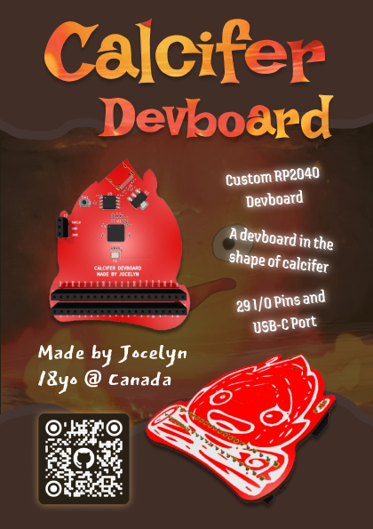
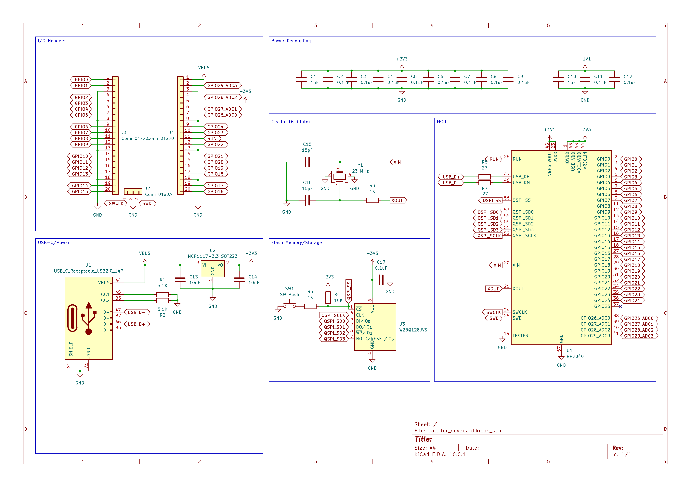
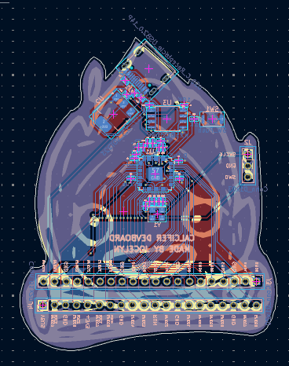
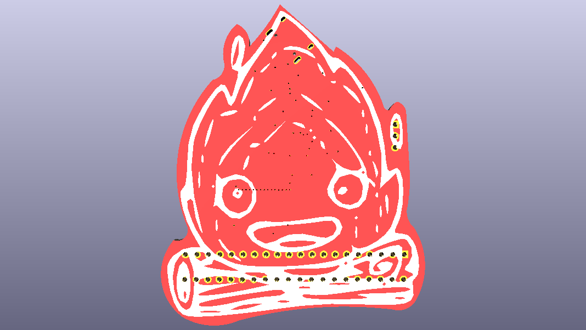
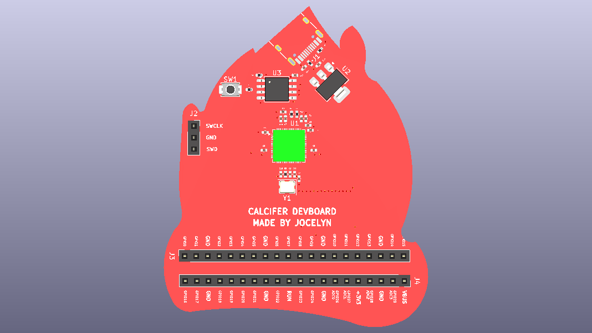

# Calcifer Devboard
Calcifer Devboard is a funny take on the RP2040 Devboard. It contains all of the basic components of what a devboard usually has like SRAM, processors, USB controllers, and breakout pins. The interesting twist on this devboard is that it is shaped like Calcifer, a character from Howl's Moving Castle.  
   

# Features
- USB-C Port  
- 12MHz Crystal Oscillator  
- 16mb Flash Storage
- 29 I/O Pins  

# Why did I make it
If you don't know the story behind Howl's Moving Castle, Calcifer is a fire demon that is trapped inside Howl's Castle and he powers and controls all of the magical things that the castle does. To me, this seemed parallel to what a devboard does in any electronics project, since a devboard is basically the heart and soul and would control all of the other components around it. 

# Diagrams
This schematic diagram looks the exact same as the guide from kaipereira.  
  
This is what my devboard looked like in the PCB editor. You can see that it has the outline and silkscreen of calcifer on it.  
  
This is what the front of the PCB should look like when it is built properly. The frontside only shows a silkscreen of calcifer and is not obstructed by any components.  
  
This is what the back of the PCB should look like. All of the components are on this side and all of the pins are clearly labeled. There is also a label saying this is made by me.  
  

# Resource
This project is all thanks to [kaipereira's guide](https://github.com/KaiPereira/build-a-devboard/blob/master/README.md) on designing an RP2040 devboard. 

# How to use
This is just a devboard so there isn't really a step-by-step assembly or firmware isntructions. 